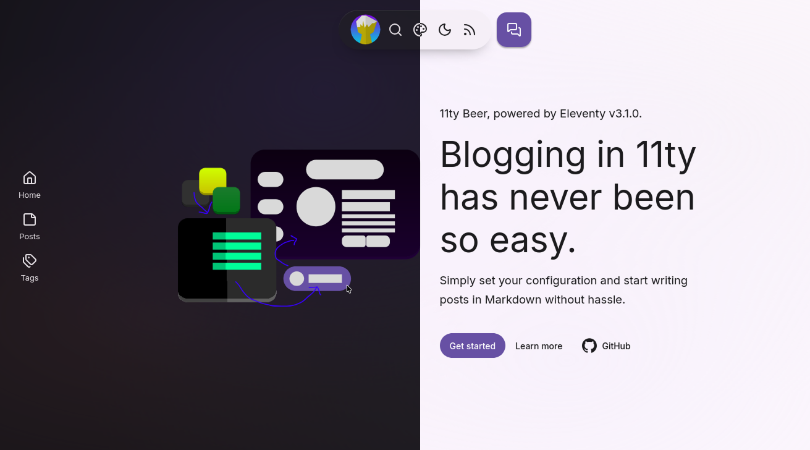

# 11ty Beer

An 11ty blog template with Material Design, PWA and minified files that simply works.

---

## Docs

Docs are provided in form of a [live demo](https://11ty-beer.vercel.app/).

## Know your rights

This project is under the MIT license:

- **Freedom to Use**: You have the right to use the software for any purpose, whether it's personal, academic, or commercial.
- **Freedom to Modify**: You can modify the source code of the software to suit your needs or preferences.
- **Freedom to Distribute**: You have the right to distribute the software, whether in its original form or modified, to others.
- **Collaboration**: You can collaborate with others on the software's development and improvement.
- **No License Compatibility Issues**: You can combine the MIT-licensed software with other software, even if they use different licenses.
- **No Usage Restrictions**: There are no restrictions on the technologies or fields of use, giving you maximum flexibility.
- **No Royalties**: You are not required to pay any royalties or fees for using, modifying, or distributing the software.

## Contributing guidelines

There are several ways to contribute to this project:

- Reporting issues
- Discussing potential improvements
- Contributing code
- Writing documentation
- Submitting feature requests
- Providing feedback

When making any sort of contribution, please make sure to follow [Forgejo's Code of Conduct](https://codeberg.org/forgejo/code-of-conduct). If you don't have the time to read it, just know that all you have to do is be nice, and you'll be just fine.

---

_Proudly built with [11ty](https://github.com/11ty/eleventy/) and [BeerCSS](https://github.com/beercss/beercss) 🍻✨_ |  _README based on [duckquill](https://codeberg.org/daudix/duckquill)._