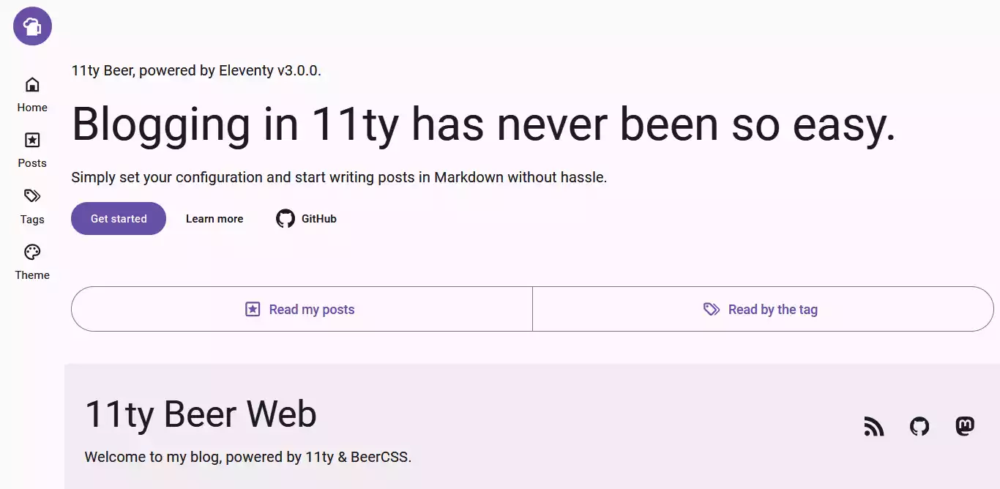
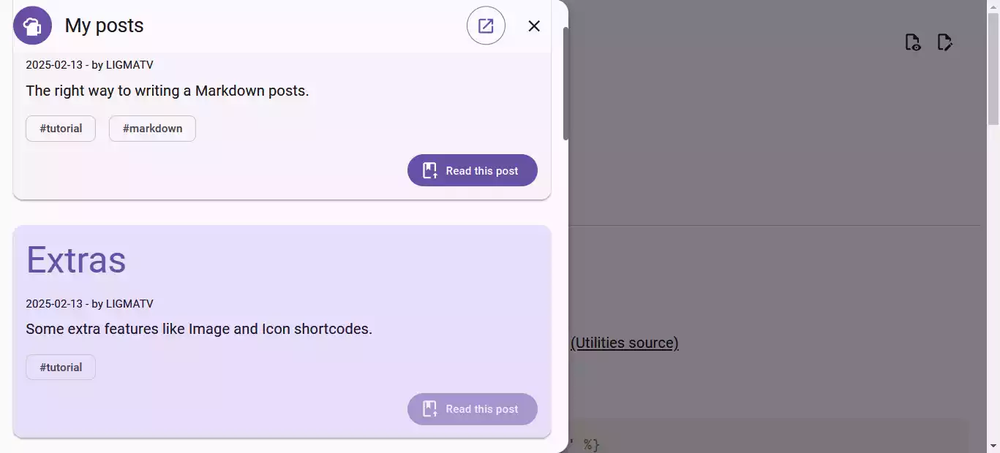
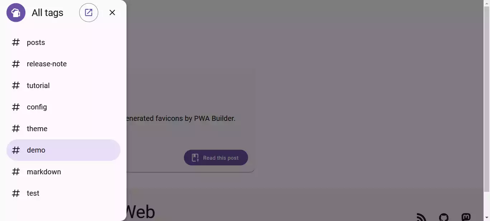
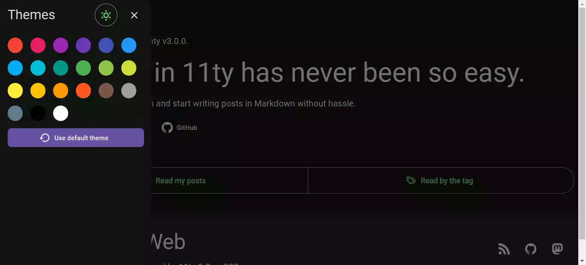

# 11ty Beer

An 11ty blog template with Material Design, PWA and minified files that simply works.

---

## Install

### With terminal

1. Clone this repository: `git clone https://github.com/LIGMATV/11ty-beer.git`
2. Open that directory: `cd 11ty-beer`
3. Install dependencies: `npm install`
4. Start development: `npm start`
5. See your website at http://localhost:8080/

### Instant deploy

- If you want to create a repository on GitHub first: **[git.new/11ty-beer](https://git.new/11ty-beer)**
- **(RECOMMENDED)** If you want to create a repository and automically deploy with Vercel: **[dub.sh/11ty-beer](https://dub.sh/11ty-beer)**

## Features

- Flawless **[simple installment](#install)**.
- Using **latest and stable** version of Eleventy [(v3.0.0)](https://github.com/11ty/eleventy/releases/tag/v3.0.0).
- **Consistent pages directory**, root pages in [`/src/pages`](/src/pages) and posts in [`/src/posts/`](/src/posts/).
- 11ty utilities **neatly arranged** in [`_utilities`](/_utilities), also the [sources](/src).
- SEO and accesibility focused, bring the **Four-hundos Lighthouse score**. [(Let you test in Pagespeed)](https://pagespeed.web.dev/analysis?url=https%3A%2F%2F11ty-beer.vercel.app%2F)
- **Easier navigation** with the exclusive modals for posts and tags.
- Just **[one configuration](/src/_data/site.json)** to go.
- Included **PWA, sitemap, feeds** and [common SEO things](/src/common/).
- All that is outside your head, **[SEO metas, icons, open graph, and feeds](/src/_includes/layouts/base.njk#L5-L31)**.
- Designed **beautiful and professional** with the bold Material Design.

---

Built with [11ty](https://github.com/11ty/eleventy/) [`v3.0.0`](https://github.com/LIGMATV/11ty-beer/blob/main/package.json#L26) and [BeerCSS](https://github.com/beercss/beercss) [`3.8.0`](https://github.com/LIGMATV/11ty-beer/blob/main/package.json#L27) 🍻✨
